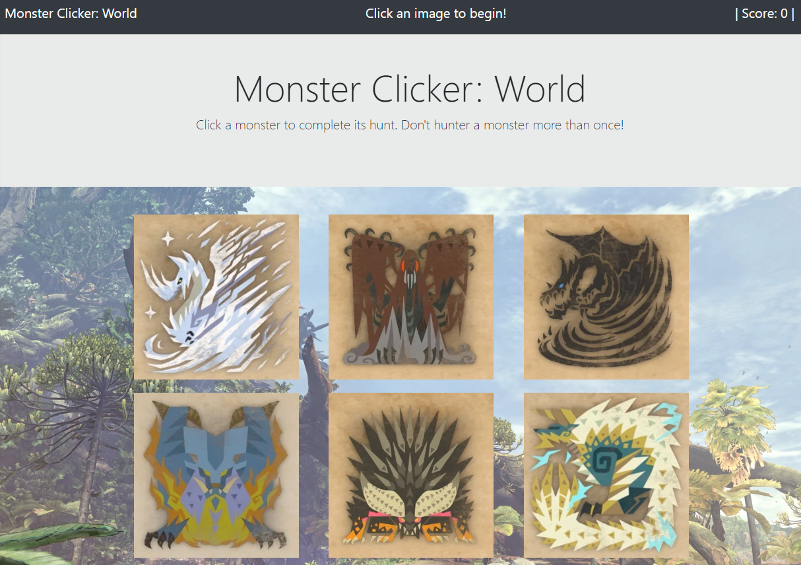
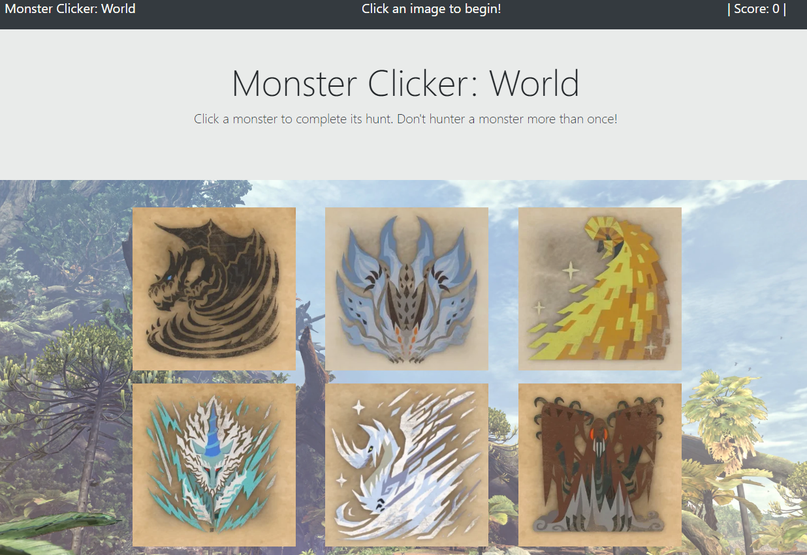
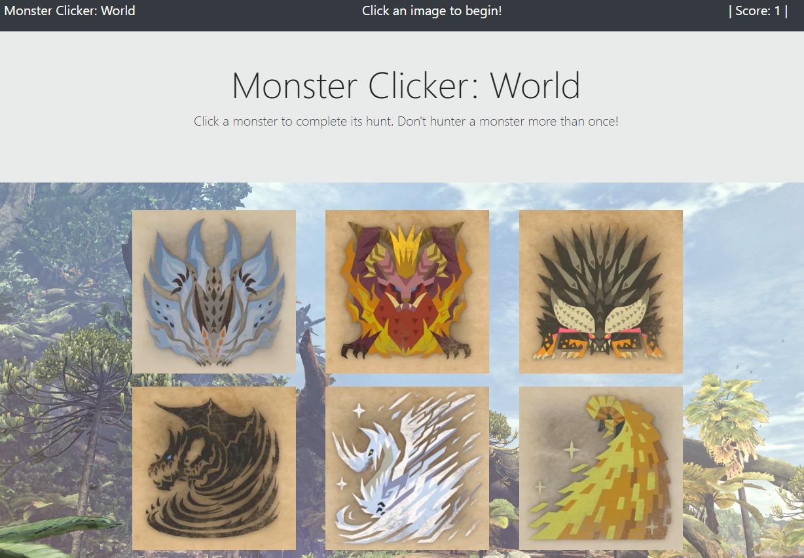
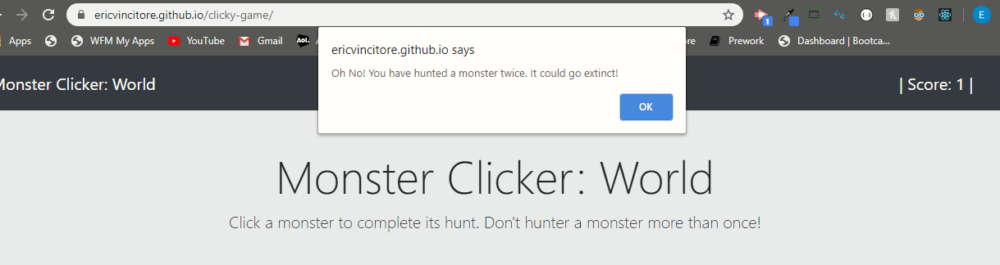

# Monster Clicker: World

A quick to play memory game with a  Monster Hunter: World theme.

## Overview

Welcome to Monster Clicker: World! This game will test the users memory of the images they have clicked. There are twelve monster images for the user to hunt. They must click each one one time to win the game. The user will lose th game if they click a monster image twice.

## Instructions

1. Navigate to the page for the app using the link below or at the bottom of this README.    
* http://EricVincitore.github.io/Monster-Clicker

2. The user should be redirected to a new page with the current menu options.  

3. Whenever the user is ready to start the game they just need to click an image. Their score will be kept track of in the upper right corner and the images will shuffle after each click.  

* Before Click  

* After Click  

4. The game will alert the user if they have clicked the same image with a loss alert.

## Links

### Deployed App Page
 
http://EricVincitore.github.io/Monster-Clicker

### Git-Hub Page

https://github.com/EricVincitore/Monster-Clicker

## Technologies Used

* HTML5
* Bootstrap
* Javascript
* Node.js
* React

## Development Role

This app was developed by Eric Vincitore.